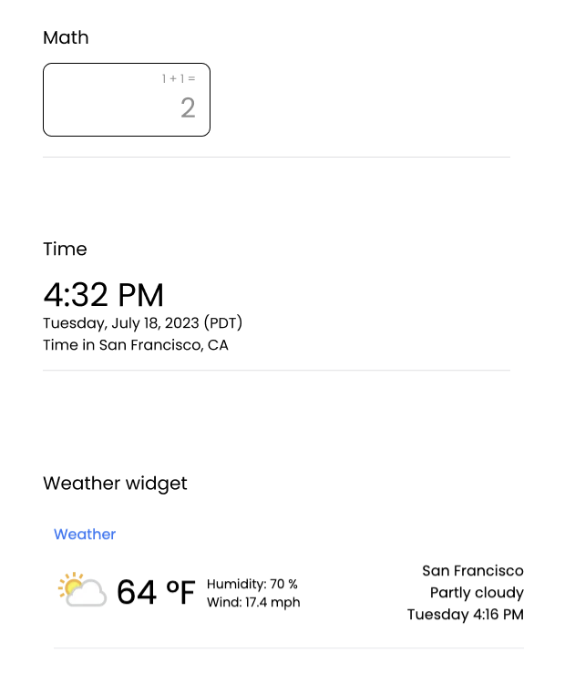

## Widgets 

Give immediate and accurate answers to common queries using widgets.

### Features 

- Simple input to submit queries
- Shows appropriate widget on submission with the answer
- Supports widgets: weather, calculator, and current time

## Figma

[Figma file and ideas](https://www.figma.com/file/797oSxVRv3wovx5JuSjHIn/Trial_Perplexity?type=design&node-id=0%3A1&mode=design&t=FMCUbS2X0Re9WDi1-1)



### Widgets

**Weather widget**: Shows current weather for requested location or in user’s locale if none specified.

- Current weather with: Hi / lo temperatures
- Current humidity, temp, wind speeds

**Calculator widget**: Shows the evaluated value of the math expression

- Determine if the query is a math expression and evaluate it. You can use the `eval` function in python to evaluate the expression.
  
**Time widget**: Shows the time for the requested location or in user’s locale if none specified.

### Quickstart
```bash
npm install
npm run dev
```

This project also requires [widgets_api](https://github.com/felgueres/widgets_api) running on `port 5000`.
